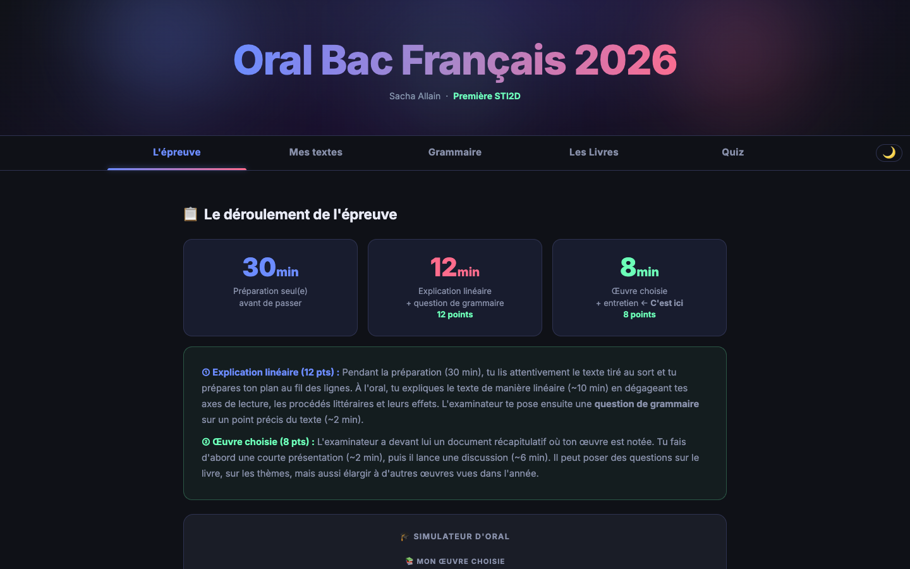

# French Baccalaureate Oral Exam 2026 — STI2D Track

A complete revision site for the French baccalaureate oral exam in French literature: close readings, set books, grammar, quizzes and a mock oral.

**[Open the site →](https://sacha9214.github.io/bac-sti2d/)**

## Content

| Tab | What's inside |
|---|---|
| **L'épreuve** (the exam) | How the oral works and how it is graded, timed mock oral |
| **Mes textes** (my texts) | 12 close readings: central question, structure, literary devices, grammar question |
| **Grammaire** (grammar) | Negation, interrogatives, complex sentences, standard oral transformations, key sentences from the texts analyzed |
| **Les livres** (books) | Full study sheets for *La Vague* (The Wave), *1984*, *Fahrenheit 451*, *Animal Farm*, *The Odyssey*, *Cyrano de Bergerac*, *Letter from an Unknown Woman*: summary, characters, themes, presentation, likely examiner questions |
| **Quiz** | Literary devices, authors, books |

An **Écoute** (listen) section reads the revision notes aloud using the browser's speech synthesis (Web Speech API).

The file [`bac_math_sujet2.html`](https://sacha9214.github.io/bac-sti2d/bac_math_sujet2.html) holds the first version of the maths revision; the full version, with 104 questions, lives in [bac-math-sti2d](https://github.com/sacha9214/bac-math-sti2d).

The site itself is in French, like the exam.

## Stack

Dependency-free HTML, CSS and JavaScript, hosted on GitHub Pages. A general-track version is available: [bac-premiere-generale](https://github.com/sacha9214/bac-premiere-generale).
